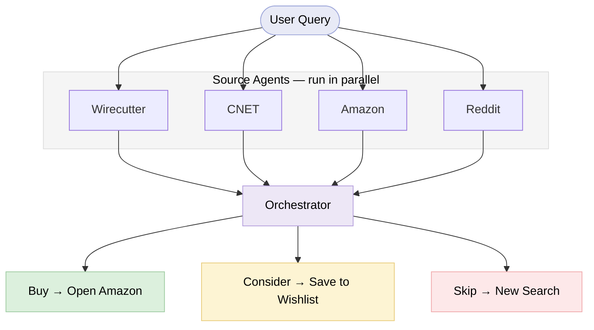

# Signal

Signal is a multi-agent product research tool that finds the signal in all the noise, synthesizing only the four most credible sources — Wirecutter, CNET, Amazon, and Reddit — into a single Buy / Consider / Skip verdict.

---

## The Problem

Product reviews are full of noise — paid placements, outdated roundups, incentivized five-stars. The credible signal exists across Wirecutter, CNET, Amazon, and Reddit, but no one has time to cross-reference four sources for every purchase. Signal does it in seconds.

---

## The Solution

Enter a product name. Four agents run in parallel, each extracting a structured verdict from its source. An orchestrator synthesizes them into a single Buy / Consider / Skip recommendation that streams to the UI in real-time and gets a shareable link.

**Stack:** FastAPI + Next.js 15 + Claude (Opus/Sonnet/Haiku) + Firecrawl + SQLite

*↑ Add a screenshot of the review page here*

---

## Architecture

Results are cached for 72 hours keyed on `(product, source)`. Completed reviews are persisted with a short shareable URL (`/review/{8hex}/{slug}`).

---

## Tradeoffs and Decisions

| Decision | What I considered | What I chose and why |
|---|---|---|
| Amazon verdict logic | Use Claude to interpret star ratings and review counts | Pure Python rules — Amazon data is deterministic; no ambiguity worth an API call |
| Source weighting | Treat all four sources equally in the orchestrator | Wirecutter ≈ CNET > Amazon > Reddit — expert methodology with known rubrics outweighs crowd volume |
| Dropping RTINGS | Build a scraper for their rigorous lab-grade measurement data | Cut it — they block scraping and have no public API; source accessibility matters as much as source quality |

---

## What I Learned

- **Scraping is difficult:** Most review sites actively block bots, and that's only getting more aggressive with AI crawlers. RTINGS, my preferred review website, does not expose an API and has a powerful defense against scrapers, Anthropic's native web fetch or third-party scrapers like the one used in this project, Firecrawl

- **Brainstorming with AI surfaces blind spots:** I built this as a read-only review aggregator. During development, collaborating with Claude surfaced an obvious gap: what does the user *do* after reading a verdict? That conversation led to the three CTAs — Buy (opens Amazon), Consider (saves to a persistent SQLite wishlist), and Skip (clears the result). None of that was in the original plan and the app is meaningfully better because the brainstorm pushed past a simple v1

- **Know when to use an LLM vs code:** It's tempting to reach for a model for everything. Amazon review data is structured and deterministic: star ratings, review counts, badges. Pure Python rules handle that cleanly and cheaply. Reddit is the opposite: unstructured sentiment from thousands of users with no rating system. The right question isn't "can AI do this?" but "does this need intelligence or logic?"
